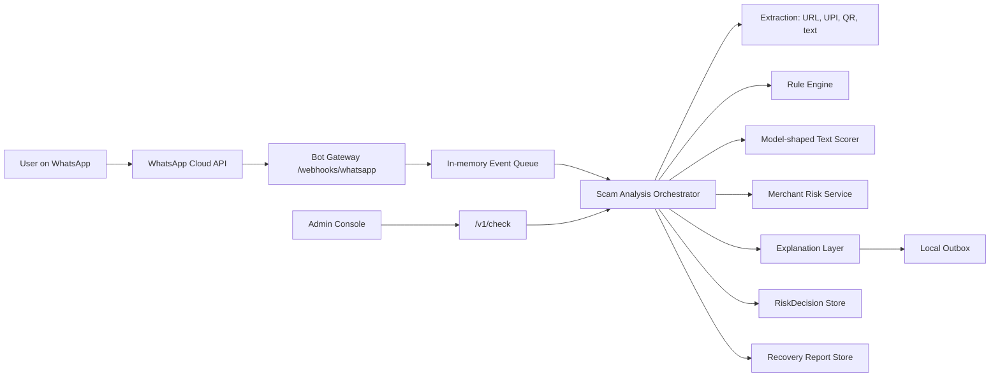

    # ScamShield Architecture

## MVP Shape



## Design Decisions

- WhatsApp is the first user surface because common users can forward suspicious text, images, UPI IDs, links, and screenshots without installing a new app.
- V1 is India-first and UPI-aware, with Hinglish-friendly responses.
- High-risk decisions are never LLM-only. The LLM/explanation layer sits after rules, model signals, URL analysis, and merchant risk scoring.
- Raw UPI IDs are not exposed in risk lookup APIs. Payees are represented by salted SHA-256 hashes.
- Reports are guidance drafts only. The app guides users to their bank, `1930`, and `cybercrime.gov.in`; it does not auto-submit official complaints.

## Service Boundary Map

| Planned Service | MVP Package | Future Upgrade |
| --- | --- | --- |
| Bot Gateway | `internal/api` | WhatsApp outbound API, signature verification, rate limits |
| Scam Analysis Orchestrator | `internal/analysis` | Separate Spring Boot or Go service |
| ML Model Service | `internal/analysis/model.go` | Python FastAPI + trained model |
| Merchant Risk Service | `internal/store` + analysis signals | PostgreSQL + graph features + Redis cache |
| Evidence Service | `mediaRef` placeholder | MinIO/S3 + retention policies |
| User Session Service | in-memory user ids | Redis/PostgreSQL |
| Admin Dashboard | `GET /admin` | Full React/Next.js analyst console |

## Risk Signal Policy

Signals contribute weighted evidence. The aggregator computes combined risk as:

```text
combined = combined + weight * (1 - combined)
```

This prevents one weak signal from dominating while allowing independent high-confidence signals to compound. Current thresholds:

- `LOW`: score < 0.35
- `CAUTION`: 0.35 to 0.64
- `HIGH_RISK`: 0.65 to 0.84
- `CRITICAL`: >= 0.85

## Covered V1 Cases

- UPI QR "receive money" scams.
- Fake KYC, PAN, Aadhaar, account block, and OTP messages.
- Fake fraud alert and safe-account transfer scams.
- Job/task scam with deposit or commission trap.
- Investment/crypto/stock-tip scam.
- Delivery/toll/courier phishing links.
- Marketplace QR/refund scams.
- Fake payment screenshot indicators.
- Loan app intimidation signals.
- Payee risk feedback and manual review queue.

