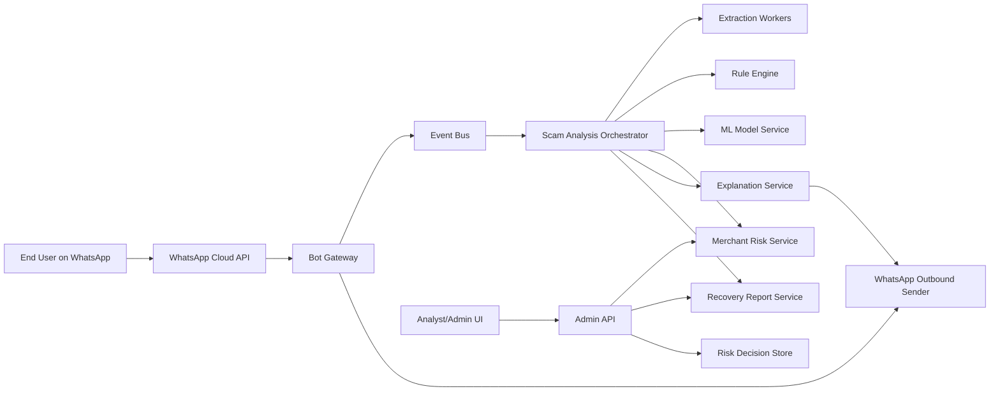
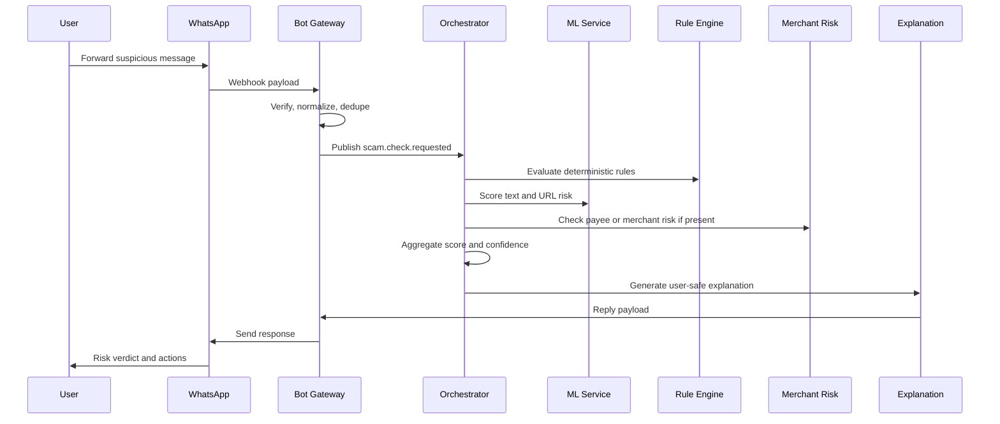

# ScamShield Full Architecture Plan

## 1. Product Shape

ScamShield is a WhatsApp-first scam and fraud protection system for Indian users. The product helps a user check suspicious messages, links, UPI IDs, QR payloads, payment screenshots, and "already paid" recovery cases before or immediately after money moves.

The core promise is:

- Warn before payment when the message, payee, QR, URL, or conversation pattern looks risky.
- Explain the risk in simple English/Hinglish.
- Preserve evidence and guide recovery when the user has already paid.
- Build a merchant/payee risk graph without exposing raw UPI IDs in public APIs.

The production system should behave like a safety assistant, not a bank, police authority, or legal decision-maker.

## 2. System Context



## 3. Production Services

| Service | Primary Responsibility | Suggested Tech |
| --- | --- | --- |
| Bot Gateway | WhatsApp webhook verification, inbound normalization, rate limits, idempotency, event publishing | Go or Spring Boot WebFlux |
| Outbound Sender | Sends WhatsApp replies, retry handling, template support, delivery status tracking | Go |
| Scam Analysis Orchestrator | Coordinates extraction, rules, model scoring, merchant risk, explanation, and final risk decisions | Spring Boot WebFlux or Go |
| Extraction Workers | OCR, QR parsing, URL canonicalization, UPI parsing, media metadata extraction | Go workers plus Python OCR adapter |
| Rule Engine | High-precision deterministic fraud rules with versioned policies | Go or Java |
| ML Model Service | Text scam classifier, URL risk model, calibration, model metadata | Python FastAPI |
| Merchant Risk Service | Salted payee hashing, complaint features, graph risk, velocity features, admin review state | Spring Boot or Go |
| Evidence Service | Secure media/evidence storage, retention, deletion, signed URL access | Go or Spring Boot |
| User Session Service | Consent, language, conversation state, recovery flow progress | Spring Boot or Go |
| Recovery Report Service | Builds structured checklists and user guidance after loss | Spring Boot or Go |
| Admin API | Analyst workflow, false-positive review, trend dashboard APIs | Spring Boot |
| Admin UI | Manual review, risk exploration, model quality views, feedback triage | Next.js or React |

For your profile, a strong production split is: Go for gateway/workers, Java Spring Boot for core domain APIs, Python for ML, Next.js for admin.

## 4. End-to-End Flows

### 4.1 Suspicious Message Check



### 4.2 UPI QR / Payee Check

1. User forwards QR screenshot or UPI intent payload.
2. Extraction Worker decodes QR or OCR text.
3. Orchestrator extracts `pa`, `pn`, `am`, and `tn` from UPI payloads.
4. Merchant Risk Service hashes the payee VPA and computes risk.
5. Rules catch "scan QR to receive money" and UPI PIN traps.
6. Response explains that UPI PIN/QR flows are for paying, not receiving.

### 4.3 Already Paid Recovery

1. User sends "already paid" or taps `Need Help`.
2. Session Service switches the conversation into recovery mode.
3. Bot collects amount, time, bank/payment app, transaction ID, scammer contact, UPI ID, URL, and screenshots.
4. Evidence Service stores media with retention rules.
5. Recovery Report Service creates a draft checklist.
6. Bot guides the user to contact the bank/payment app, call `1930`, and file at `cybercrime.gov.in`.

V1 must not auto-submit official complaints. It can prepare a structured summary for the user.

## 5. Data Architecture

### 5.1 Core Stores

| Store | Data | Production Choice |
| --- | --- | --- |
| User/session store | Consent, language, WhatsApp ID hash, current flow | PostgreSQL plus Redis cache |
| Risk decision store | Final decisions, scores, signals, model versions | PostgreSQL |
| Merchant/payee risk store | Salted payee hashes, aliases, complaint counts, graph features | PostgreSQL plus graph-ready tables |
| Evidence store | Screenshots, media metadata, retention timestamps | MinIO/S3 |
| Feature store | Online merchant/user/payee features | Redis first, later Feast or custom store |
| Event log | Inbound events, risk decisions, feedback, model outcomes | Kafka/Redpanda |
| Analytics store | Aggregated trends, model monitoring, admin dashboards | ClickHouse, Postgres, or BigQuery later |

### 5.2 Important Tables

`risk_decisions`

- `decision_id`
- `user_hash`
- `input_type`
- `risk_level`
- `score`
- `confidence`
- `scam_type`
- `top_signals`
- `model_versions`
- `created_at`

`payee_risk_profiles`

- `payee_hash`
- `risk_score`
- `complaint_count`
- `first_seen_at`
- `last_seen_at`
- `alias_count`
- `connected_risk_count`
- `review_status`

`feedback_events`

- `feedback_id`
- `decision_id`
- `user_hash`
- `verdict`
- `payee_hash`
- `comment`
- `created_at`

`recovery_reports`

- `report_id`
- `user_hash`
- `decision_id`
- `status`
- `structured_summary`
- `official_steps`
- `created_at`
- `expires_at`

`evidence_objects`

- `evidence_id`
- `report_id`
- `object_key`
- `media_type`
- `sha256`
- `retention_until`
- `created_at`

## 6. Event Architecture

Kafka/Redpanda topics:

| Topic | Producer | Consumer |
| --- | --- | --- |
| `whatsapp.inbound.v1` | Bot Gateway | Orchestrator |
| `media.extraction.requested.v1` | Orchestrator | Extraction Workers |
| `media.extraction.completed.v1` | Extraction Workers | Orchestrator |
| `risk.decision.created.v1` | Orchestrator | Admin API, Analytics, Outbound Sender |
| `whatsapp.reply.requested.v1` | Orchestrator | Outbound Sender |
| `feedback.received.v1` | Bot Gateway/Admin API | Merchant Risk, Analytics |
| `merchant.risk.updated.v1` | Merchant Risk | Orchestrator cache, Admin UI |
| `recovery.report.created.v1` | Recovery Report Service | Outbound Sender, Admin UI |
| `model.prediction.logged.v1` | ML Service | Model monitoring |

Event rules:

- Every event carries `eventId`, `correlationId`, `causationId`, `schemaVersion`, and `createdAt`.
- Consumers must be idempotent by `eventId`.
- Risk decisions are immutable; corrections arrive as feedback/review events.
- Raw UPI IDs should not be placed in broad event topics. Use `payeeHash` unless a restricted service needs raw input during extraction.

## 7. API Contracts

Public/internal user APIs:

- `POST /webhooks/whatsapp`
- `GET /webhooks/whatsapp`
- `POST /v1/check`
- `POST /v1/feedback`
- `GET /v1/risk/payee/{payeeHash}`
- `GET /v1/reports/{reportId}`

Service APIs:

- `POST /internal/model/score-text`
- `POST /internal/model/score-url`
- `POST /internal/extract/qr`
- `POST /internal/extract/ocr`
- `POST /internal/explain`
- `POST /internal/payee/observe`
- `POST /internal/payee/report`

The `RiskDecision` contract remains the central shared shape:

```json
{
  "decisionId": "uuid",
  "inputType": "TEXT|URL|QR|UPI_ID|SCREENSHOT",
  "riskLevel": "LOW|CAUTION|HIGH_RISK|CRITICAL",
  "score": 0.0,
  "confidence": 0.0,
  "scamType": "UPI_COLLECT|PHISHING|IMPERSONATION|JOB_SCAM|INVESTMENT|UNKNOWN",
  "topSignals": ["urgency", "upi_pin_to_receive_money", "brand_spoofing"],
  "userMessage": "string",
  "recommendedActions": ["string"],
  "needsHumanReview": false
}
```

## 8. AI and Risk Architecture

### 8.1 Hybrid Decision Policy

The production system should use a layered ensemble:

1. Extraction: normalize text, parse URLs, decode QR, extract UPI IDs, OCR screenshots.
2. Deterministic rules: high-precision patterns for known scam types.
3. ML models: text classifier, URL risk model, merchant anomaly model.
4. Merchant risk: complaint velocity, first-seen age, alias changes, connected identifiers.
5. Aggregator: score, confidence, risk level, dominant scam type.
6. Explanation: user-facing response in English/Hinglish.

The explanation service cannot reduce a high-risk verdict. It can only explain or ask for missing context.

### 8.2 Model Roadmap

Phase 1:

- Deterministic rules and simple calibrated text scoring.
- Synthetic and curated scam examples.
- Manual false-positive review.

Phase 2:

- Fine-tuned multilingual text classifier for English, Hindi, and Hinglish.
- URL lexical classifier.
- QR/UPI feature model.
- Confidence calibration.

Phase 3:

- Graph-based payee risk using complaint clusters, aliases, device/session links, and velocity.
- Drift monitoring and active learning loop.
- Human review sampling for high-impact decisions.

## 9. Security, Privacy, and Abuse Controls

- Hash UPI IDs and WhatsApp user IDs with environment-specific salts.
- Encrypt object storage and database volumes.
- Use short retention windows for screenshots unless the user starts a recovery report.
- Provide delete/export paths for stored reports.
- Do not store OTPs, UPI PINs, or full card details. Detect and redact them before persistence.
- Verify WhatsApp webhooks and reject replayed message IDs.
- Rate-limit by user hash, IP, and WhatsApp sender.
- Make admin access role-based with audit logs.
- Treat all LLM inputs as untrusted. Add prompt-injection filters and structured output validation.

## 10. Observability

Service-level metrics:

- Webhook ACK latency.
- End-to-end verdict latency.
- Queue lag per topic.
- Model service latency and error rate.
- OCR/QR extraction success rate.
- Outbound delivery success/failure.

Risk-quality metrics:

- High-risk precision from user feedback.
- False-positive rate by scam type.
- Unknown/needs-review rate.
- Top emerging scam signals.
- Model drift by language and channel.

Operational traces:

- Correlate webhook event, extraction, model scoring, merchant risk, decision, explanation, and outbound send using `correlationId`.

## 11. Deployment Plan

Local:

- Current Go MVP.
- Docker Compose for Postgres, Redis, Redpanda, and MinIO.

Staging:

- One namespace or VM with all services.
- WhatsApp test number.
- Seeded synthetic data.
- Basic admin auth.

Production beta:

- Managed Postgres.
- Managed Redis.
- Kafka/Redpanda cluster.
- Object storage with lifecycle retention.
- Container deployment through Docker/Kubernetes or a simple VM-based deployment first.
- Secrets through cloud secret manager or sealed environment variables.

## 12. Milestones

M1 - Production-ready MVP backend:

- Replace in-memory storage with Postgres.
- Add Redis rate limits and session state.
- Add outbound WhatsApp sender.
- Add webhook signature/replay protection.

M2 - Media intelligence:

- WhatsApp media download.
- QR decoding.
- OCR extraction.
- Evidence retention/deletion policy.

M3 - ML service:

- Python FastAPI model service.
- Text scam classifier.
- URL risk scorer.
- Model version logging.

M4 - Merchant risk:

- Payee risk profile tables.
- Complaint velocity features.
- Admin review workflows.

M5 - Private beta:

- Controlled WhatsApp test users.
- Feedback loop.
- Quality dashboard.
- Incident and abuse playbooks.

