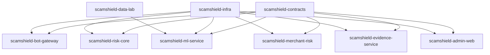

# ScamShield Multi-Repository Plan

## 1. Goal

The current repo is a working MVP. The multi-repository plan turns it into a production-style distributed system while keeping clear ownership, deployability, and contract boundaries.

Use multi-repo when:

- Services have different runtimes, release cycles, or owners.
- Model code should evolve independently from backend APIs.
- Infrastructure and contracts need controlled versioning.
- Admin UI should ship without touching risk engines.

Avoid splitting too early. The current Go MVP should remain the reference implementation until contracts stabilize.

## 2. Recommended Repository Map

| Repo | Purpose | Stack | Deployable |
| --- | --- | --- | --- |
| `scamshield-contracts` | Shared OpenAPI specs, AsyncAPI events, JSON schemas, test fixtures | YAML/JSON/Markdown | No |
| `scamshield-bot-gateway` | WhatsApp webhook, inbound normalization, outbound sender, rate limits | Go | Yes |
| `scamshield-risk-core` | Orchestration, rules, risk aggregation, recovery report coordination | Spring Boot WebFlux or Go | Yes |
| `scamshield-ml-service` | Text, URL, QR/media scoring models and calibration | Python FastAPI | Yes |
| `scamshield-merchant-risk` | Payee hashing, complaint features, graph risk, merchant review state | Spring Boot or Go | Yes |
| `scamshield-evidence-service` | Media metadata, object storage, retention, deletion | Go or Spring Boot | Yes |
| `scamshield-admin-web` | Analyst dashboard and manual review UI | Next.js/React | Yes |
| `scamshield-infra` | Docker Compose, Terraform, Kubernetes/Helm, observability configs | Terraform/YAML | No direct app |
| `scamshield-data-lab` | Synthetic data, notebooks, offline evaluation, labeling scripts | Python | No |

If you want the most resume-friendly split, use Go for gateway/workers, Spring Boot for `risk-core` and `merchant-risk`, Python for ML, and Next.js for admin.

## 3. Dependency Direction



Rules:

- Application repos depend on `scamshield-contracts`, not on each other directly.
- Service-to-service communication happens through HTTP APIs and Kafka/Redpanda events.
- `scamshield-infra` deploys released container images; it should not import application code.
- `scamshield-data-lab` can produce model artifacts, but production model serving belongs to `scamshield-ml-service`.

## 4. Repository Details

### 4.1 `scamshield-contracts`

Owns:

- OpenAPI files for public and internal APIs.
- AsyncAPI files for Kafka/Redpanda topics.
- JSON schemas for `RiskDecision`, `FeedbackEvent`, `MerchantRiskProfile`, and `RecoveryReport`.
- Shared sample payloads.
- Contract test fixtures.

Suggested structure:

```text
openapi/
  public-api.yaml
  risk-core-internal.yaml
  ml-service.yaml
asyncapi/
  events.yaml
schemas/
  risk-decision.schema.json
  feedback-event.schema.json
fixtures/
  whatsapp/
  risk-decisions/
docs/
  versioning.md
```

Release rule:

- Tag contract releases as `contracts-vMAJOR.MINOR.PATCH`.
- Breaking changes require a major version and migration notes.

### 4.2 `scamshield-bot-gateway`

Owns:

- WhatsApp webhook verification.
- Inbound message normalization.
- Webhook deduplication and idempotency.
- User rate limiting.
- Outbound WhatsApp message sending.
- Local outbox only in dev mode.

Does not own:

- Fraud decision logic.
- Merchant/payee scoring.
- Model inference.

APIs/events:

- Receives `POST /webhooks/whatsapp`.
- Publishes `whatsapp.inbound.v1`.
- Consumes `whatsapp.reply.requested.v1`.
- Publishes `feedback.received.v1` from button replies.

### 4.3 `scamshield-risk-core`

Owns:

- Scam check orchestration.
- Rule engine.
- Risk score aggregation.
- Risk decision persistence.
- Recovery report coordination.
- User-facing final verdict policy.

Does not own:

- Raw media storage.
- ML model training.
- WhatsApp-specific protocol details.

APIs/events:

- Consumes `whatsapp.inbound.v1`.
- Calls ML, Merchant Risk, Evidence, and Explanation adapters.
- Publishes `risk.decision.created.v1`.
- Publishes `whatsapp.reply.requested.v1`.

### 4.4 `scamshield-ml-service`

Owns:

- Text scam classifier.
- URL risk scorer.
- OCR/QR model hooks if implemented in Python.
- Model versioning and calibration.
- Prediction logging.

Does not own:

- Final product risk policy.
- User explanation.
- Admin review status.

APIs:

- `POST /internal/model/score-text`
- `POST /internal/model/score-url`
- `GET /internal/model/metadata`

### 4.5 `scamshield-merchant-risk`

Owns:

- Raw payee normalization inside a restricted boundary.
- Salted payee hashing.
- Payee risk profiles.
- Complaint velocity features.
- Alias clustering.
- Admin review state.

APIs/events:

- `POST /internal/payee/observe`
- `POST /internal/payee/report`
- `GET /internal/payee/{payeeHash}`
- Consumes `feedback.received.v1`.
- Publishes `merchant.risk.updated.v1`.

Privacy rule:

- Public APIs return `payeeHash`, never raw VPA.
- Raw VPA access should be restricted to the merchant-risk service and short-lived processing paths.

### 4.6 `scamshield-evidence-service`

Owns:

- Media metadata.
- Object storage keys.
- Signed upload/download URLs.
- Retention and deletion.
- Redaction pipeline hooks.

APIs:

- `POST /internal/evidence`
- `GET /internal/evidence/{evidenceId}`
- `DELETE /internal/evidence/{evidenceId}`

### 4.7 `scamshield-admin-web`

Owns:

- Analyst dashboard.
- Manual review queue.
- Feedback triage.
- Payee risk exploration.
- Model quality and drift panels.

Backends:

- Calls Admin API in `risk-core` or a separate `admin-api` module if the team grows.

### 4.8 `scamshield-infra`

Owns:

- Local Docker Compose.
- Kubernetes manifests or Helm charts.
- Terraform for cloud resources.
- Grafana dashboards.
- OpenTelemetry Collector config.
- Secret names and environment templates.

Does not own:

- App business logic.
- Model code.

### 4.9 `scamshield-data-lab`

Owns:

- Synthetic scam data generation.
- Labeling utilities.
- Offline evaluation.
- Training notebooks/scripts.
- Model cards.

Promotion rule:

- A model moves from `data-lab` to `ml-service` only after it has a version, metrics, calibration notes, and rollback plan.

## 5. Migration From Current MVP

Phase A - Stabilize contracts in current repo:

- Extract request/response examples from current Go structs.
- Add OpenAPI and JSON schema files.
- Keep current Go service as the integration reference.

Phase B - Create `scamshield-contracts`:

- Move API/event schemas and fixtures there.
- Add contract validation in CI.
- Update MVP repo to read fixtures from a copied contract release.

Phase C - Split `bot-gateway`:

- Move `internal/api/whatsapp.go` and webhook handling.
- Replace local event channel with Kafka/Redpanda producer.
- Keep `/v1/outbox` only as a dev endpoint.

Phase D - Split `risk-core`:

- Move orchestrator, rules, aggregation, recovery report logic.
- Add Postgres-backed risk decision store.
- Consume `whatsapp.inbound.v1`.

Phase E - Split `ml-service`:

- Replace `ScoreTextModel` with HTTP/gRPC call to Python FastAPI.
- Add model metadata and prediction logging.

Phase F - Split merchant/evidence/admin:

- Move payee hashing and risk storage to `merchant-risk`.
- Move media references and report evidence to `evidence-service`.
- Replace simple `/admin` page with `admin-web`.

## 6. Cross-Repo Contract Workflow

1. Change starts in `scamshield-contracts`.
2. Contract CI validates schema, examples, and backward compatibility.
3. Application repo opens a PR updating generated clients or copied schemas.
4. Consumer contract tests run against local service.
5. Deployment happens service by service, backward compatible first.
6. Old fields are removed only after all consumers have moved.

Versioning policy:

- Additive fields: minor version.
- Breaking field rename/removal: major version.
- Behavior-only changes: patch version plus release note.

## 7. CI/CD Plan

Every service repo:

- Lint.
- Unit tests.
- Contract tests using `scamshield-contracts` fixtures.
- Docker image build.
- Vulnerability scan.
- Push image with git SHA and semantic version tag.

Environment deploy:

- Dev deploy on merge to `main`.
- Staging deploy on release tag.
- Production beta deploy by manual approval.

Minimum quality gates:

- API compatibility check.
- No critical vulnerabilities.
- Test pass.
- OpenTelemetry traces enabled.
- Rollback image available.

## 8. Local Development Plan

Use `scamshield-infra` for shared local dependencies:

```text
docker-compose.yml
  postgres
  redis
  redpanda
  minio
  otel-collector
  grafana
```

Each app repo should support:

- `make test`
- `make run`
- `make docker-build`
- `.env.example`
- `/health`
- `/ready`

For Windows-first development, also provide PowerShell scripts:

- `scripts/test.ps1`
- `scripts/run.ps1`
- `scripts/local-up.ps1`

## 9. Ownership Boundaries

| Decision | Owning Repo |
| --- | --- |
| WhatsApp payload shape | `scamshield-bot-gateway` plus contracts |
| Final risk threshold | `scamshield-risk-core` |
| Text model architecture | `scamshield-ml-service` |
| Payee risk feature policy | `scamshield-merchant-risk` |
| Media retention | `scamshield-evidence-service` |
| Dashboard workflow | `scamshield-admin-web` |
| Topic names and infra | `scamshield-infra` plus contracts |

## 10. Suggested Build Order

1. Keep current MVP repo running as `scamshield-mvp`.
2. Create `scamshield-contracts`.
3. Create `scamshield-infra`.
4. Split `scamshield-bot-gateway`.
5. Split `scamshield-risk-core`.
6. Add `scamshield-ml-service`.
7. Add `scamshield-merchant-risk`.
8. Add `scamshield-evidence-service`.
9. Add `scamshield-admin-web`.
10. Archive or repurpose the MVP repo as an integration sandbox.

This order keeps the product demonstrable at every step.

